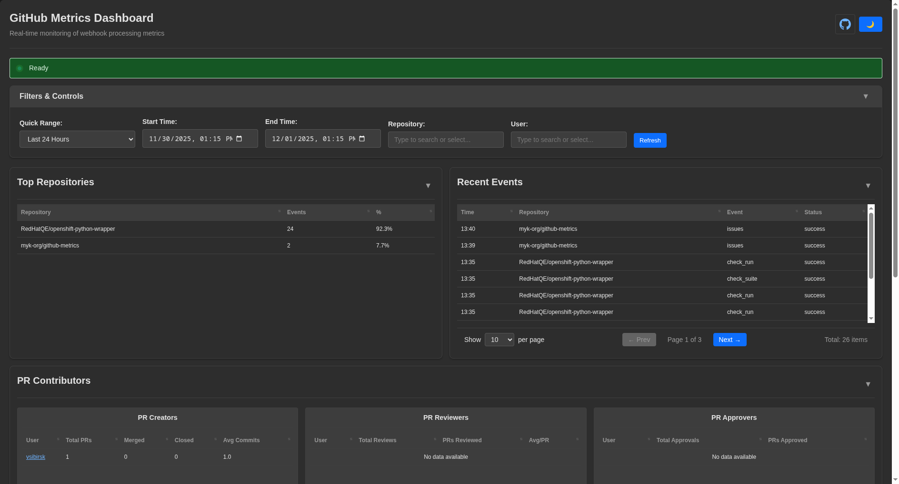
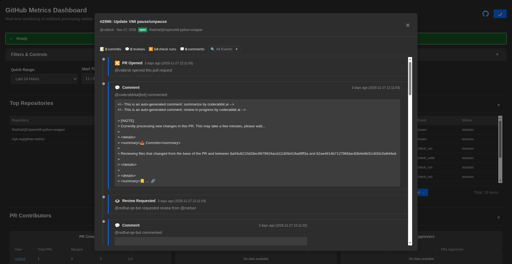

<h1 align="center">GitHub Metrics</h1>

<p align="center">
  <strong>Real-time GitHub webhook tracking and analytics dashboard</strong>
</p>

<p align="center">
  <a href="https://github.com/myk-org/github-metrics">
    
  </a>
  <a href="https://github.com/myk-org/github-metrics">
    
  </a>
  <a href="LICENSE">
    
  </a>
</p>

<p align="center">
  
</p>

<p align="center">
  <em>Interactive PR Story Modal - Track the complete lifecycle of pull requests</em>
</p>

<p align="center">
  
</p>

---

## Why GitHub Metrics?

Track, analyze, and visualize your GitHub repository activity in real-time. GitHub Metrics provides a comprehensive solution for monitoring webhook events, PR workflows, CI/CD pipelines, and API usage—all from a single, beautiful dashboard.

Perfect for teams who want to:
- **Monitor** repository activity and webhook health in real-time
- **Analyze** PR lifecycle, review patterns, and contributor metrics
- **Optimize** GitHub API usage and track rate limit consumption
- **Integrate** with AI assistants via MCP (Model Context Protocol) for natural language queries

---

## Features

🔔 **Webhook Processing** - Secure webhook receiver with IP allowlist verification and HMAC SHA256 signature validation

📊 **Real-time Dashboard** - Interactive web interface with sidebar navigation, Overview and Contributors views, live updates via WebSocket streaming, and dark/light theme support

⏱️ **Review Turnaround Metrics** - Track time to first review, approval time, and PR lifecycle duration by repository and reviewer with human-readable time formats

💾 **Event Storage** - Comprehensive event tracking in PostgreSQL with full payload storage and optimized indexing

🔍 **PR Analytics** - Track pull request lifecycle, reviews, labels, code metrics, and contributor statistics

⚙️ **CI/CD Monitoring** - Monitor check runs, test results, pipeline execution, and build status

📈 **API Usage Tracking** - Track GitHub API rate limit consumption, token spend, and optimization opportunities

🔌 **REST API** - Query metrics programmatically with filtering, pagination, and time-range support

🤖 **MCP Server** - Expose metrics as tools for LLM integration (Claude, ChatGPT, etc.) with natural language queries

🔒 **Security** - Multi-layer security with IP allowlist (GitHub/Cloudflare), webhook signature validation, and secure configuration

🚀 **Auto-Setup** - Optionally auto-create webhooks on startup for configured repositories

---

## Dashboard Views

The interactive dashboard provides two specialized views accessible via sidebar navigation:

### Overview

The main dashboard view includes:
- **Real-time Event Stream** - Live webhook events with filters for repository, event type, and status
- **Repository Statistics** - Event counts, success rates, and processing times per repository
- **Activity Trends** - Time-series charts showing webhook volume over time
- **PR Story Modal** - Complete PR lifecycle timeline with reviews, comments, and check runs

### Contributors

Review turnaround analytics and contributor performance:
- **Summary KPI Cards** - Quick metrics for average first review time, approval time, PR lifecycle duration, and total PRs analyzed
- **Turnaround by Repository** - Review metrics broken down by repository with sortable columns
- **Turnaround by Reviewer** - Individual reviewer response times and PR review counts
- **Human-Readable Time Format** - Times displayed as "6m", "1.1h", "2d 5h" for easy interpretation

Both views share common filtering capabilities:
- **Repository Filter** - ComboBox dropdown with fuzzy search across all repositories
- **User Filter** - ComboBox dropdown to filter by specific users
- **Time Range** - Defaults to last 7 days, configurable for custom date ranges
- **Clear Filters** - One-click reset button (X) to clear all active filters
- **Data Export** - Download filtered data as CSV or JSON for external analysis and reporting

---

## Quick Start

### Three Simple Steps

1. **Copy the Docker Compose configuration:**

```bash
cp examples/docker-compose.yaml docker-compose.yaml
```

2. **Create your environment file:**

```bash
echo "POSTGRES_PASSWORD=your-secure-password-here" > .env
```

3. **Launch the service:**

```bash
docker-compose up -d
```

That's it! Access the dashboard at **http://localhost:8080/dashboard**

The service automatically handles database migrations and configuration.

---

## Configuration

All configuration is managed via environment variables—no configuration files needed.

### Required Environment Variables

| Variable              | Description              | Example           |
| --------------------- | ------------------------ | ----------------- |
| `METRICS_DB_NAME`     | PostgreSQL database name | `github_metrics`  |
| `METRICS_DB_USER`     | PostgreSQL username      | `metrics`         |
| `METRICS_DB_PASSWORD` | PostgreSQL password      | `secure-password` |

<details>
<summary><strong>Database Configuration</strong></summary>

| Variable               | Description          | Default     |
| ---------------------- | -------------------- | ----------- |
| `METRICS_DB_HOST`      | Database host        | `localhost` |
| `METRICS_DB_PORT`      | Database port        | `5432`      |
| `METRICS_DB_POOL_SIZE` | Connection pool size | `20`        |

</details>

<details>
<summary><strong>Server Configuration</strong></summary>

| Variable                         | Description                                              | Default   |
| -------------------------------- | -------------------------------------------------------- | --------- |
| `METRICS_SERVER_HOST`            | Server bind host                                         | `0.0.0.0` |
| `METRICS_SERVER_PORT`            | Server bind port                                         | `8080`    |
| `METRICS_SERVER_WORKERS`         | Uvicorn workers                                          | `4`       |
| `METRICS_SERVER_ALLOW_ALL_HOSTS` | Allow binding to 0.0.0.0 (required for wildcard binding) | `false`   |

</details>

<details>
<summary><strong>Security Configuration</strong></summary>

| Variable               | Description                                 | Default         |
| ---------------------- | ------------------------------------------- | --------------- |
| `METRICS_API_KEYS`     | Comma-separated API keys for authentication | Empty (no auth) |
| `METRICS_CORS_ORIGINS` | Comma-separated CORS origins                | Empty           |

</details>

<details>
<summary><strong>Webhook Security Configuration</strong></summary>

| Variable                        | Description                                            | Default               |
| ------------------------------- | ------------------------------------------------------ | --------------------- |
| `METRICS_WEBHOOK_SECRET`        | Secret for validating webhook signatures (HMAC SHA256) | Empty (no validation) |
| `METRICS_VERIFY_GITHUB_IPS`     | Verify requests from GitHub IP allowlist               | `false`               |
| `METRICS_VERIFY_CLOUDFLARE_IPS` | Verify requests from Cloudflare IP allowlist           | `false`               |

</details>

<details>
<summary><strong>Webhook Auto-Setup Configuration</strong></summary>

| Variable                | Description                                                   | Default |
| ----------------------- | ------------------------------------------------------------- | ------- |
| `METRICS_SETUP_WEBHOOK` | Enable automatic webhook creation on startup                  | `false` |
| `METRICS_GITHUB_TOKEN`  | GitHub token for API access (requires repo admin permissions) | Empty   |
| `METRICS_WEBHOOK_URL`   | URL where webhooks will be delivered                          | Empty   |
| `METRICS_REPOSITORIES`  | Comma-separated list of repositories (org/repo format)        | Empty   |

</details>

<details>
<summary><strong>MCP Server Configuration</strong></summary>

| Variable              | Description                           | Default |
| --------------------- | ------------------------------------- | ------- |
| `METRICS_MCP_ENABLED` | Enable MCP server for LLM integration | `true`  |

</details>

---

## API Reference

### Health Check

```http
GET /health
```

Returns service health status and database connectivity.

**Response:**
```json
{
  "status": "healthy",
  "database": true,
  "version": "0.1.0"
}
```

### Webhook Receiver

```http
POST /metrics
```

Receives GitHub webhook events with IP and signature verification.

**Required Headers:**
- `X-GitHub-Delivery`: Unique webhook delivery ID
- `X-GitHub-Event`: Event type (pull_request, issue_comment, etc.)
- `X-Hub-Signature-256`: HMAC SHA256 signature (if `METRICS_WEBHOOK_SECRET` is set)

**Response:**
```json
{
  "status": "ok",
  "delivery_id": "12345678-1234-1234-1234-123456789abc"
}
```

### Dashboard

```http
GET /dashboard
```

Interactive web dashboard with real-time metrics visualization and theme switcher.

### WebSocket Streaming

```http
WS /metrics/ws?repository=org/repo&event_type=pull_request&status=success
```

Real-time metrics streaming with optional filtering.

**Query Parameters:**
- `repository`: Filter by repository (org/repo format)
- `event_type`: Filter by event type
- `status`: Filter by status (success, error, partial)

<details>
<summary><strong>REST API Endpoints</strong></summary>

### Get Webhook Events

```http
GET /api/metrics/webhooks
```

Retrieve webhook events with filtering and pagination.

**Query Parameters:**
- `repository`: Filter by repository (org/repo format)
- `event_type`: Filter by event type
- `status`: Filter by status (success, error, partial)
- `start_time`: Start time in ISO 8601 format (e.g., 2024-01-15T00:00:00Z)
- `end_time`: End time in ISO 8601 format
- `page`: Page number (1-indexed, default: 1)
- `page_size`: Items per page (1-1000, default: 100)

**Response:**
```json
{
  "data": [
    {
      "delivery_id": "12345678-1234-1234-1234-123456789abc",
      "repository": "org/repo",
      "event_type": "pull_request",
      "action": "opened",
      "pr_number": 123,
      "sender": "username",
      "status": "success",
      "created_at": "2024-01-15T10:30:00Z",
      "processed_at": "2024-01-15T10:30:01Z",
      "duration_ms": 1234,
      "api_calls_count": 5,
      "token_spend": 5,
      "token_remaining": 4995,
      "error_message": null
    }
  ],
  "pagination": {
    "total": 1000,
    "page": 1,
    "page_size": 100,
    "total_pages": 10,
    "has_next": true,
    "has_prev": false
  }
}
```

### Get Webhook Event by ID

```http
GET /api/metrics/webhooks/{delivery_id}
```

Get specific webhook event details including full payload.

### Get Repository Statistics

```http
GET /api/metrics/repositories
```

Get aggregated statistics per repository.

**Query Parameters:**
- `start_time`: Start time in ISO 8601 format
- `end_time`: End time in ISO 8601 format
- `page`: Page number (1-indexed, default: 1)
- `page_size`: Items per page (1-100, default: 10)

**Response:**
```json
{
  "time_range": {
    "start_time": "2024-01-01T00:00:00Z",
    "end_time": "2024-01-31T23:59:59Z"
  },
  "repositories": [
    {
      "repository": "org/repo",
      "total_events": 1000,
      "successful_events": 980,
      "failed_events": 20,
      "success_rate": 98.0,
      "avg_processing_time_ms": 1234,
      "total_api_calls": 5000,
      "total_token_spend": 5000
    }
  ],
  "pagination": {
    "total": 50,
    "page": 1,
    "page_size": 10,
    "total_pages": 5,
    "has_next": true,
    "has_prev": false
  }
}
```

### Get Metrics Summary

```http
GET /api/metrics/summary
```

Get overall metrics summary across all repositories.

**Response:**
```json
{
  "time_range": {
    "start_time": "2024-01-01T00:00:00Z",
    "end_time": "2024-01-31T23:59:59Z"
  },
  "summary": {
    "total_events": 10000,
    "successful_events": 9800,
    "failed_events": 200,
    "success_rate": 98.0,
    "avg_processing_time_ms": 1234,
    "total_api_calls": 50000,
    "total_token_spend": 50000,
    "unique_repositories": 50,
    "unique_senders": 100
  }
}
```

</details>

---

## MCP Server

GitHub Metrics includes an embedded **Model Context Protocol (MCP)** server for seamless AI assistant integration.

### Overview

The MCP server exposes metrics endpoints as tools that AI assistants like Claude can query using natural language. Mounted at `/mcp`, it automatically provides access to all REST API endpoints.

### Available Tools

| Tool                        | Description                                             |
| --------------------------- | ------------------------------------------------------- |
| `health_check`              | Check service health and database connectivity          |
| `get_webhook_events`        | Retrieve webhook events with filtering and pagination   |
| `get_webhook_event_by_id`   | Get specific webhook event details including payload    |
| `get_repository_statistics` | Get aggregated statistics per repository                |
| `get_metrics_summary`       | Get overall metrics summary (events, trends, top repos) |
| `get_metrics_contributors`  | Get PR contributor analytics                            |
| `get_user_pull_requests`    | Get user's PR details with commit info                  |
| `get_metrics_trends`        | Get time-series event trends                            |

### Configuration for MCP Clients

Add to your MCP client configuration (e.g., Claude Desktop):

```json
{
  "mcpServers": {
    "github-metrics": {
      "url": "http://localhost:8080/mcp"
    }
  }
}
```

### Example Natural Language Queries

Once configured, you can ask your AI assistant:
- "Get metrics for the last 24 hours"
- "Show repository statistics for myk-org/github-metrics"
- "Who are the top PR contributors this month?"
- "What's the webhook success rate for the last week?"

### Disabling MCP Server

To disable the MCP server:

```bash
METRICS_MCP_ENABLED=false
```

---

## Webhook Setup

### Automatic Webhook Creation

Enable automatic webhook creation by setting environment variables:

```bash
# Enable webhook setup
METRICS_SETUP_WEBHOOK=true

# GitHub token with repo admin permissions
METRICS_GITHUB_TOKEN=ghp_xxxxxxxxxxxxxxxxxxxx

# URL where webhooks will be delivered
METRICS_WEBHOOK_URL=https://your-domain.com/metrics

# Repositories to configure (comma-separated)
METRICS_REPOSITORIES=org/repo1,org/repo2,org/repo3

# Optional: Webhook secret for signature validation
METRICS_WEBHOOK_SECRET=your-webhook-secret
```

On startup, the service will:
1. Check if webhooks already exist for each repository
2. Create new webhooks if they don't exist
3. Configure webhooks to send all events (`["*"]`)
4. Log success/failure for each repository

### Manual Webhook Configuration

To manually configure webhooks in GitHub:

1. Navigate to: **Repository Settings → Webhooks → Add webhook**
2. Set **Payload URL**: `https://your-domain.com/metrics`
3. Set **Content type**: `application/json`
4. Set **Secret**: (same as `METRICS_WEBHOOK_SECRET` if configured)
5. Select **Which events**: "Send me everything" or specific events
6. Ensure **Active** is checked
7. Click **Add webhook**

---

## Security

### Multi-Layer Security

GitHub Metrics implements defense-in-depth security:

#### IP Allowlist Verification

```bash
# Verify requests from GitHub IPs
METRICS_VERIFY_GITHUB_IPS=true

# Verify requests from Cloudflare IPs (if using Cloudflare proxy)
METRICS_VERIFY_CLOUDFLARE_IPS=true
```

The service fetches IP ranges from:
- **GitHub**: `https://api.github.com/meta` (hooks field)
- **Cloudflare**: `https://www.cloudflare.com/ips-v4` and `ips-v6`

#### Webhook Signature Validation

```bash
# Set webhook secret (same secret configured in GitHub)
METRICS_WEBHOOK_SECRET=your-webhook-secret
```

The service validates webhook signatures using HMAC SHA256 (`X-Hub-Signature-256` header).

#### Server Binding Security

**IMPORTANT:** By default, binding to wildcard addresses (`0.0.0.0` or `::`) requires explicit opt-in.

**Production recommendation:**
```bash
# Option 1: Bind to specific interface (most secure)
METRICS_SERVER_HOST=127.0.0.1  # Localhost only - use with reverse proxy

# Option 2: Bind to all interfaces (requires opt-in)
METRICS_SERVER_HOST=0.0.0.0
METRICS_SERVER_ALLOW_ALL_HOSTS=true  # Explicit security acknowledgment
```

**Why this matters:**
- Binding to `0.0.0.0` exposes the service on ALL network interfaces
- In containerized deployments, you typically want `0.0.0.0` (with proper network isolation)
- For local development or single-host deployments, `127.0.0.1` is safer
- The explicit opt-in prevents accidental exposure to unintended networks

### Deployment Best Practices

✅ **Recommended security measures:**
- Deploy behind a reverse proxy (nginx, Caddy) with HTTPS/TLS
- Use firewall rules to restrict access to webhook endpoint
- Store secrets in environment variables or secret management systems (Vault, AWS Secrets Manager)
- Enable both IP verification and signature validation for maximum security
- Never expose PostgreSQL port to public internet (bind to `127.0.0.1` only)
- Use strong database passwords (generated, not dictionary words)
- Regularly rotate webhook secrets and API keys
- Monitor logs for suspicious activity

---

## Development

### Requirements

- **Python** 3.13+
- **PostgreSQL** 16+
- **uv** (Python package manager)

### Local Setup

1. **Clone the repository:**

```bash
git clone https://github.com/myk-org/github-metrics.git
cd github-metrics
```

2. **Install dependencies:**

```bash
uv sync
```

3. **Configure environment:**

```bash
export METRICS_DB_NAME=github_metrics
export METRICS_DB_USER=metrics
export METRICS_DB_PASSWORD=dev-password
export METRICS_DB_HOST=localhost
export METRICS_DB_PORT=5432
```

4. **Run database migrations:**

```bash
uv run alembic upgrade head
```

5. **Start the development server:**

```bash
uv run entrypoint.py
```

The service will start on `http://localhost:8080`.

### Code Quality

```bash
# Format code
uv run ruff format

# Lint code
uv run ruff check

# Fix linting issues
uv run ruff check --fix

# Type checking
uv run mypy github_metrics/

# Run all checks (pre-commit hooks)
prek run --all-files
```

### Testing

```bash
# Run tests (parallel execution)
uv run --group tests pytest -n auto

# Run with coverage (90% required)
uv run --group tests pytest -n auto --cov=github_metrics --cov-report=term-missing

# Run specific test file
uv run --group tests pytest tests/test_app.py -v
```

### Database Migrations

Migrations are automatically applied on container startup. For manual operations:

**Using Docker (Production/Container):**

```bash
# Apply migrations (automatic on container start, or manual)
docker exec -it github-metrics alembic upgrade head

# Rollback last migration
docker exec -it github-metrics alembic downgrade -1

# Show migration history
docker exec -it github-metrics alembic history
```

**Local Development:**

```bash
# Create new migration
uv run alembic revision --autogenerate -m "Description of changes"

# Apply migrations
uv run alembic upgrade head

# Rollback last migration
uv run alembic downgrade -1

# Show migration history
uv run alembic history
```

### Database Schema

The service stores data in the following PostgreSQL tables:

- **webhooks**: Webhook event store with full payload and processing metrics
- **pull_requests**: PR master records with size metrics and state tracking
- **pr_events**: PR timeline events for analytics
- **pr_reviews**: Review data for approval tracking
- **pr_labels**: Label history for workflow tracking
- **check_runs**: Check run results for CI/CD metrics
- **api_usage**: GitHub API usage tracking for rate limit monitoring

All tables use PostgreSQL-specific types (UUID, JSONB) for optimal performance and include comprehensive indexes for fast queries.

---

## Contributing

Contributions are welcome! Please follow these guidelines:

1. **Fork the repository** and create a feature branch
2. **Follow code style**: Run `prek run --all-files` before committing
3. **Write tests**: Maintain 90% code coverage
4. **Update documentation**: Keep README.md and docstrings current
5. **Submit a pull request** with a clear description of changes

### Development Workflow

```bash
# Create feature branch
git checkout -b feature/your-feature-name

# Make changes and test
uv run --group tests pytest -n auto --cov=github_metrics

# Run code quality checks
prek run --all-files

# Commit and push
git commit -m "feat: add new feature"
git push origin feature/your-feature-name
```

---

## License

Apache-2.0

---

## Author

**myakove**

---

<p align="center">
  <sub>Built with FastAPI, PostgreSQL, and ❤️</sub>
</p>
